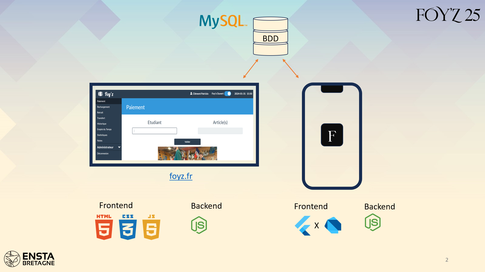

# Foy'z Tech Revolution
It's a school project to create a scalable digital architecture. 

The goal is to create an application developed in Dart (Flutter) or Javascript (React Native) to allow students from the school to have access to their bar account. 
It should be developed relatively to the existent structure of the web site (which could be edited if necessary). 

## Goals : 
   -   Develop an application (in Dart or JavaScript, your choice) to support the existing student center website, adhering to an already pre-developed but still highly modular architecture.
   -   Apply software design principles (from the CSN and SOIA courses in the 2nd year) to make the future structure a modular and scalable solution.
   -   Draw inspiration from artificial intelligence principles to perform data processing, helping clients (in this case, the student center managers) make informed decisions about the products to offer for sale.
   -   Complete the project using teamwork strategies provided in the project management courses.

## Potential languages used : 
CSS - HTML - Java Script - SQL - Dart - React Native - Git

## Architecture brief presentation : 

## Full presentation : 

